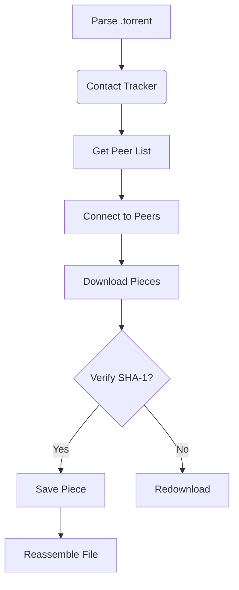

# BitTorrent Protocol Guide 🧩

---

## Table of Contents 🔍
1. [Core Concepts](#core-concepts-)
2. [Key Components](#key-components-)
3. [Download Process](#download-process-)
4. [Client-Server vs BitTorrent](#client-server-vs-bittorrent-)
5. [Torrent File Structure](#-torrent-file-structure)
6. [Peer Protocol Handshake](#-peer-protocol-handshake)
7. [Message Types](#-message-types)
8. [Piece Selection Strategies](#-piece-selection-strategies)
9. [File Verification](#-file-verification-)

---

## Core Concepts 💡

- **Decentralized Sharing**: Files split into **256KB-1MB pieces**
- **Peer-to-Peer (P2P)**: Users share directly with each other
- **Torrent File**: Metadata blueprint with hashes & tracker info
- **Tracker Server**: Coordinates peer discovery

---

## Key Components 🔧

| Component       | Description                                                                 |
|-----------------|-----------------------------------------------------------------------------|
| `.torrent` File | Contains SHA-1 hashes, file structure, and tracker URL                     |
| Tracker         | Central server that maintains peer IP addresses                            |
| Seeders         | Peers with 100% of the file                                                 |
| Leechers        | Peers downloading + sharing partial files                                  |

---

## Download Process 📥

## Client-Server vs BitTorrent ⚖️
### Traditional Method 🖥️

YOU (Server)
│
└──► 100 Friends Downloading
    ► Bandwidth Overload! 💥
